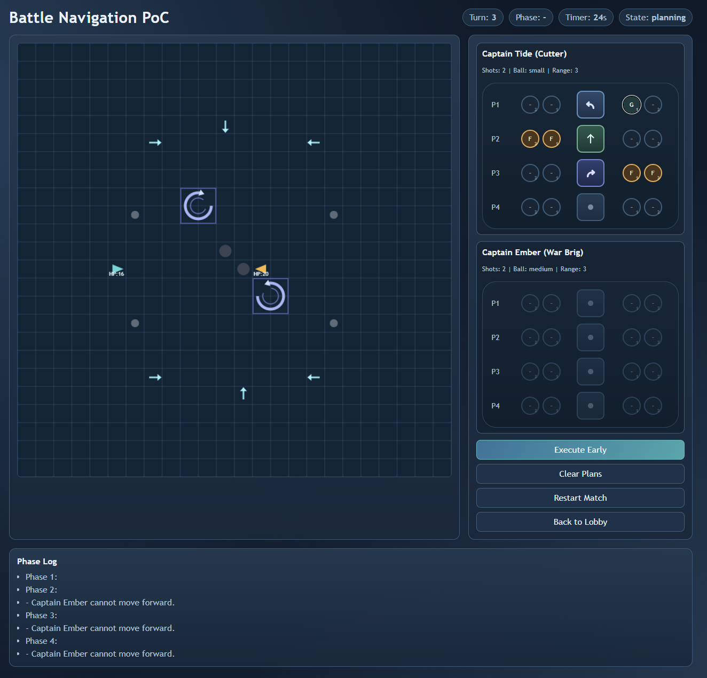
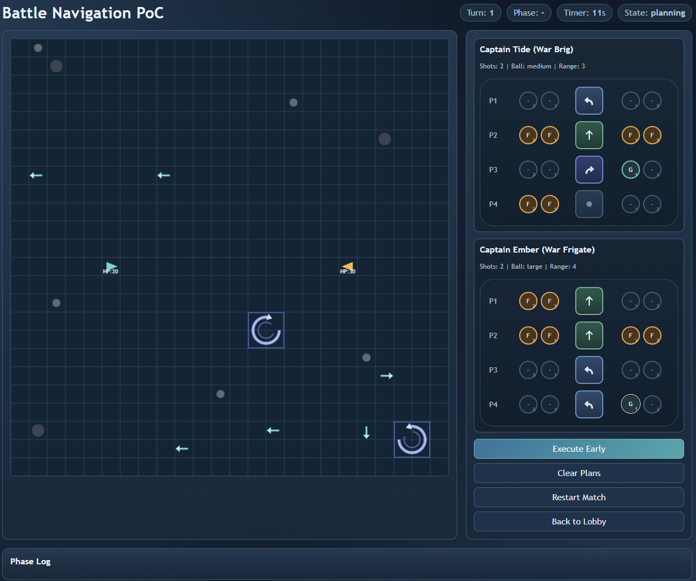

# ⚓ Battle Navigation - Tactical Naval Duel

<p align="center">
  
</p>

[](https://itzmorphinetime.github.io/BattleNav/)
[](https://www.javascript.com/)


Fast, mind-game-heavy naval tactics inspired by Puzzle Pirates "Sea Battle / Battle Navigation".
Plan four micro-actions under a 30 second timer, then watch the turn resolve phase-by-phase.

**[🕹️ Play the Game Here](https://itzmorphinetime.github.io/BattleNav/)**

---

## 🖼️ Screenshots

<p align="center">
  
</p>

---

## ✨ Features

### 🧠 Simultaneous Planning
- 4-phase planning per turn with a 30 second timer
- Port and starboard actions can be selected independently
- Deterministic resolution with clear phase-by-phase playback

### 🔥 Combat & Hazards
- Port/starboard cannons with cannonball sizes and multi-shot rules
- Grapple action for instant win at close range
- Hazards: wind currents, 2x2 whirlpools, large/small rocks
- Shots stop at first impact with explosions and water splashes

### 🌊 Presentation
- Curved turn arcs and collision bump feedback
- Projectile shots with impact VFX
- Phase log with readable outcomes

### 🧭 Modes & Maps
- Local hotseat or AI opponent
- Curated default arena or procedural map generation
- Ship roster with distinct stats

---

## 🚀 Getting Started

### Play Online
Visit **[itzmorphinetime.github.io/BattleNav](https://itzmorphinetime.github.io/BattleNav/)** to play instantly in your browser.

### Run Locally

1. **Clone the repository**
   ```bash
   git clone https://github.com/ItzMorphineTime/BattleNav.git
   cd BNav
   ```

2. **Serve locally**
   ```bash
   python -m http.server 5173
   ```
   Then open `http://localhost:5173` in your browser.

> Note: Opening `index.html` via `file://` may be blocked by some browsers due to module import rules.

---

## 🎮 How to Play

1. Choose player count, ship types, and map mode in the lobby.
2. Queue four phases using the planner on the right.
3. Each phase includes:
   - Movement: None | Forward | Turn Left | Turn Right
   - Actions (per side): None | Shoot | Grapple
4. Hit "Execute Early" or let the timer expire.

---

## 🚢 Ship Types (Current Defaults)
- **Sloop:** HP 10, range 2, small shot, 1 cannon
- **Cutter:** HP 16, range 3, small shot, 2 cannons
- **War Brig:** HP 20, range 3, medium shot, 2 cannons
- **Dhow:** HP 14, range 3, medium shot, 1 cannon
- **War Frigate:** HP 30, range 4, large shot, 2 cannons
- **Baghlah:** HP 24, range 4, large shot, 1 cannon

Current matchup: **P1 Cutter** vs **P2 War Brig**.

---

## 🛠️ Technology Stack

- **Pure JavaScript (ES6+)** - No frameworks or libraries
- **HTML5 Canvas** - Fast 2D rendering
- **Deterministic Simulation** - Same inputs, same outputs

---

## 📁 Project Structure

```
index.html
styles.css
screenshots/
  Screenshot_01.png
  Screenshot_02.png
src/
  main.js
  game/
    constants.js
    state.js
    simulation.js
    rules-movement.js
    rules-combat.js
    rules-win.js
    hazards.js
    ai.js
  ui/
    hud.js
    planner.js
    timer.js
    playback.js
    renderer2d.js
docs/
  IMPLEMENTATION_PLAN.md
  IMPLEMENTED.md
```

---

## 🎯 Roadmap

- [ ] Replay export/import
- [ ] Map seed input + map editor tools
- [ ] 3D ships + animated combat effects (Three.js)
- [ ] Multiplayer lobbies (create/join/host) + turn sync

---

## 🤝 Contributing

Contributions are welcome:

1. Fork the repository
2. Create a feature branch (`git checkout -b feature/AmazingFeature`)
3. Commit your changes (`git commit -m "Add some AmazingFeature"`)
4. Push to the branch (`git push origin feature/AmazingFeature`)
5. Open a Pull Request

### Development Guidelines
- Keep gameplay deterministic
- Preserve readability in phase playback
- Update `docs/IMPLEMENTATION_PLAN.md` and `docs/IMPLEMENTED.md` when features land

---

## 📝 License

This project is licensed under the Apache License - see the [LICENSE](LICENSE) file for details.

---

## 🙏 Acknowledgments

- Inspired by **Puzzle Pirates: Sea Battle / Battle Navigation**
- Built with a love of mind games, boardgame tactics, and tight iteration

---

## 🌟 Show Your Support

If you enjoyed this project, please consider:
- ⭐ Starring the repository
- 🐛 Reporting bugs
- 💡 Suggesting features
- 🔀 Contributing code

---

**[⚓ Set Sail Now](https://itzmorphinetime.github.io/BattleNav/)**
